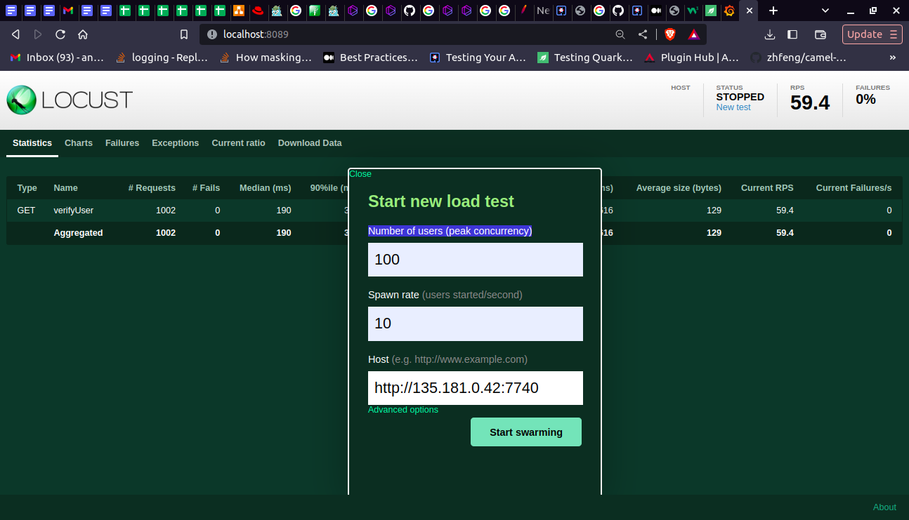
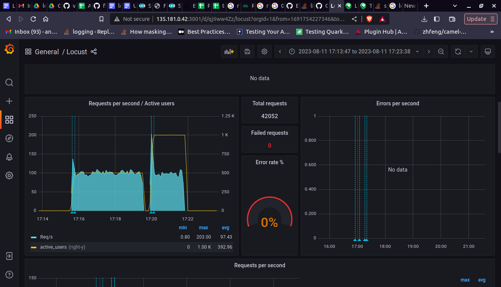

<center>

# Load Test Setup

 </center>


 ## 1. Task requirement:

To show the result of response time in grafana with the help of load test.

## 2. Load Testing 

Load Testing is a non-functional software testing process in which the performance of software application is tested under a specific expected load. It determines how the software application behaves while being accessed by multiple users simultaneously.


## 3. Environmental detail:

* OS: Ubuntu 20.04

* Podman 3.4.1

## 4. List of tools and technologies:


* Grafana: Version 2
* Postgres: Version 4
* Locust: Customised
 

* ## Definition of tools:

* ### **Grafana:**

 Grafana is a multi-platform open source analytics and interactive visualisation web application. It provides charts, graphs, and alerts for the web when connected to supported data sources. It can be easily installed using Docker or Docker Compose.

* ### **PostgreSQL:**

 PostgreSQL, also known as Postgres, is a free and open-source relational database management system emphasising extensibility and SQL compliance.

* ### **Locust** 

 Locust is an open-source load-testing tool. Load testing is a type of software testing that is conducted to check the tolerance/behaviour of the system under a specific expected load.

# Command for the setup or configuration


* ## Load test without grafana and timescale-db


~~~
  pip3 install locust
  pip3 install locust_plugins
  locust locustfile.py 
~~~


### Using container:
~~~
podman run -itd --name loadtesting -p 8089:8089 -v <Directory Path>:/mnt/locust localhost/loadtest:v1 -f /mnt/locust/locustfile.py
~~~


### **Note:** 
 localhost/loadtest:v1 is an image with the in-built locust_plugins.please find the images below.

[Click Here](https://drive.google.com/file/d/1rTd02C1ypJtOlnHLIQPaiWp5N9TrUnX_/view?ts=64b0edc6
)

## Load test with Grafana and timescale db.

### Setting up grafana and postgres db.

 Create a pod with name timescale and expose ports 5432 and 3000

~~~
podman pod create --name timescale --publish 5432:5432 --publish 3000:3000
~~~

Create a postgres container, give it the desired environment variables, attach it to the created pod


~~~
podman run -dt \
    --pod timescale \
    --name timescale-postgres \
    -e POSTGRES_PASSWORD=password \
    -e TIMESCALEDB_TELEMETRY=off \
    -v <directory Path>:/var/lib/postgresql/data \
    cyberw/locust-timescale:4
~~~


 Create the grafana container, give it the desired environment variables, importantly PGHOST, attach it to the created pod

~~~
podman run -dt \
	--pod timescale \
	--name timescale-grafana \
	-e GF_AUTH_DISABLE_LOGIN_FORM=true \
	-e GF_AUTH_ANONYMOUS_ENABLED=true \
	-e GF_AUTH_ANONYMOUS_ORG_ROLE=Admin \
	-e GF_SECURITY_ALLOW_EMBEDDING=true \
	-e GF_LOG_LEVEL=warn \
	-e PGHOST=localhost \
	-v <Directory Path>:/var/lib/grafana \
        cyberw/locust-grafana:2
~~~


 Create another temporary script to manage users data and run the same script. 


~~~
GRAFANA_CRED="admin:admin"
GRAFANA_HOST="http://localhost:3000"
GRAFANA_OVERWRITE=false
DS_NAME="locust_timescale"
PGHOST="postgres"
PGPORT="5432"
~~~


~~~
curl -u "$GRAFANA_CRED" $GRAFANA_HOST/api/datasources -XPOST -H "Accept: application/json" -H "Content-Type: application/json" -d '{"access": "proxy","basicAuth": false,"basicAuthPassword": "","basicAuthUser": "","database": "postgres","isDefault": false,"jsonData": {"postgresVersion": 1200,"sslmode": "disable", "timescaledb": true},"name": "'$DS_NAME'","orgId": 1,"password": "","readOnly": false,"secureJsonData": {"password": "password"},"type": "postgres","url": "'$PGHOST':'$PGPORT'","user": "postgres","version": 3,"withCredentials": false}'
~~~

### Output

~~~
ds=(10878 14423 14422 15419);
for d in "${ds[@]}"; do
  echo -n "Processing $d: "
  j=$(curl -s -k -u "$GRAFANA_CRED" $GRAFANA_HOST/api/gnet/dashboards/$d | jq .json)
  echo "{\"dashboard\":"${j}",\"overwrite\":$GRAFANA_OVERWRITE,\"inputs\":[{\"name\":\"DS_LOCUST\",\"type\":\"datasource\", \"pluginId\":\"postgres\",\"value\":\"$DS_NAME\"}]}" > payload.json
  curl -v -k -u "$GRAFANA_CRED" -H "Accept: application/json"\
    -H "Content-Type: application/json"\
    -d @payload.json \
    $GRAFANA_HOST/api/dashboards/import; echo ""
Done
~~~


## Validate setup

validate postgres

~~~
podman exec -it timescale-postgres bash
bash-5.1# psql -U postgres
psql (13.7)
Type "help" for help.

postgres=# \dt
~~~

### List of relations

| Schema | Name | Type | Owner |
|--------| -----| -----| ------|
| public | events | table | postgres|
| public | request | table | postgres|
| public | testrun | table | postgres|
| public | user_count | table | postgres|

(4 rows)

~~~
postgres=# select * from user_count ;
~~~


| testplan | user_count | time | run_id |
|--------| -----| -----| ------|

(0 rows)

###  validate grafana

Open browser http://localhost:3000 will show the home page of grafana, check the datasource and test the connection. 

##  Setup locust 

  run the locust container with grafana and postgres configuration


~~~
podman run -itd --name loadtesting -p 8089:8089 -v <directory path to mount>:/mnt/locust localhost/loadtest:v1 -f /mnt/locust/locustfile.py --timescale --grafana-url=http://<machine ip>:3000 --pghost=<machine ip> --pgport=5432 --pgpassword=password --pguser=postgres
~~~

### Run the load test with grafana and timescale-DB

Locust ui exposed to the http://localhost:8089
Start a new test with the number of users and spawn rate.



 You can see the user_count table as follows-


```
postgres=# select * from user_count ;
```
|  testplan | user_count | time | run_id |
|--------| -----| -----| ------|
|  /mnt/locust/locustfile.py | 10 | 2023-08-21 17:35:59.013368+00 | 2023-08-21 17:35:58.96389+00|
|  /mnt/locust/locustfile.py | 30 | 2023-08-21 17:36:01.030325+00 | 2023-08-21 17:36:01.030325+00 |
|   /mnt/locust/locustfile.py |         50 | 2023-08-21 17:36:03.036033+00 | 2023-08-21 17:35:58.96389+00 |
|  /mnt/locust/locustfile.py |         70 | 2023-08-21 17:36:05.042359+00 | 2023-08-21 17:35:58.96389+00 |
| /mnt/locust/locustfile.py |         90 | 2023-08-21 17:36:07.048253+00 | 2023-08-21 17:35:58.96389+00|
|  /mnt/locust/locustfile.py |        100 | 2023-08-21 17:36:09.053782+00 | 2023-08-21 17:35:58.96389+00 |
|  /mnt/locust/locustfile.py |        100 | 2023-08-21 17:36:11.059233+00 | 2023-08-21 17:35:58.96389+00 |

(7 rows)


You can add panels in grafana to get the graphical view of the responses.




 #### **Test cases list(sample format mentioned below):**

|S No.  | Component/Tool Name | Test case | Test Count | Test Cases | Expected Result | Test Passed [PASS/FAIL] | Remarks |
-------- | -------------------- | ---------- |  ----------  | ----------  | ---------------  | ----------------------- | ---------
<!--

 **Note** No test cases were performed during the activity. -->

 **Reference link**

 * https://grafana.com/tutorials/grafana-fundamentals/

